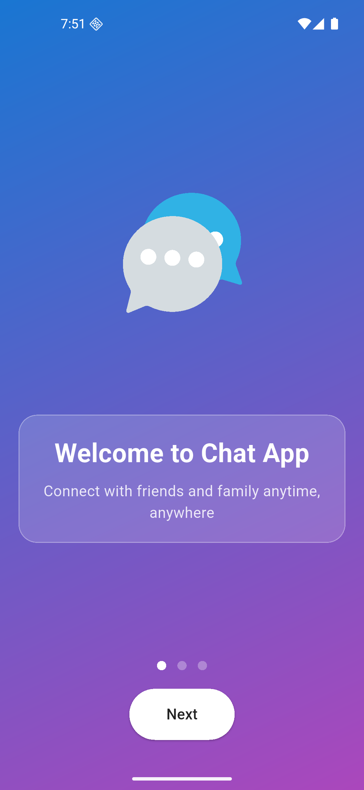
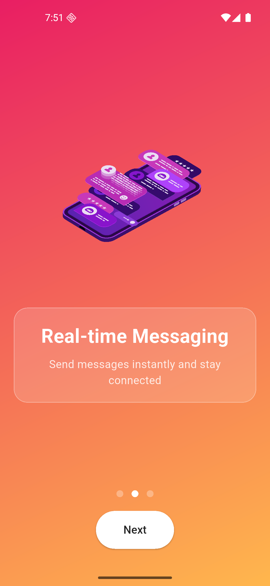
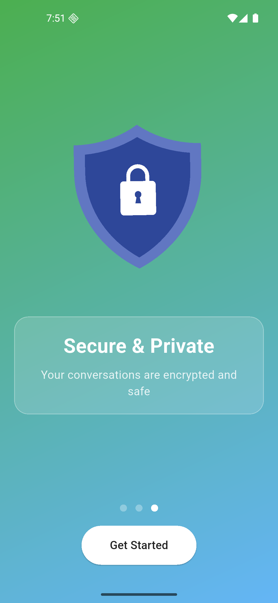
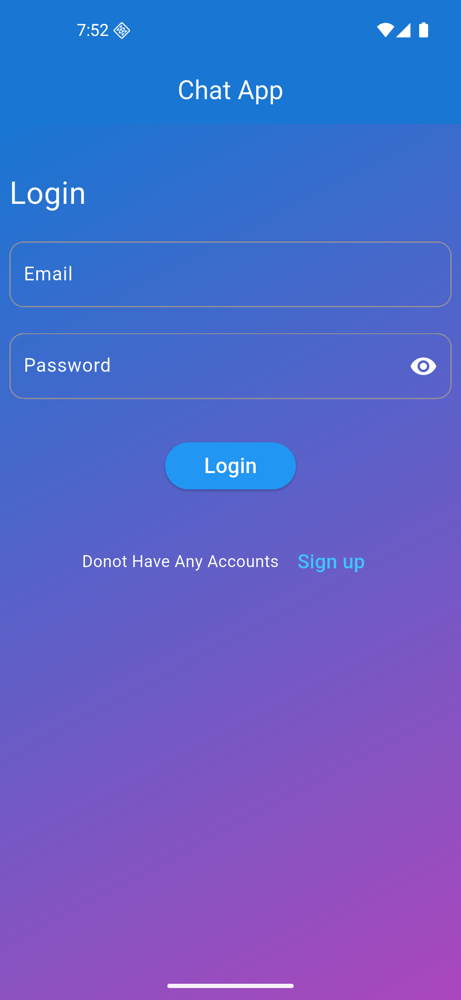
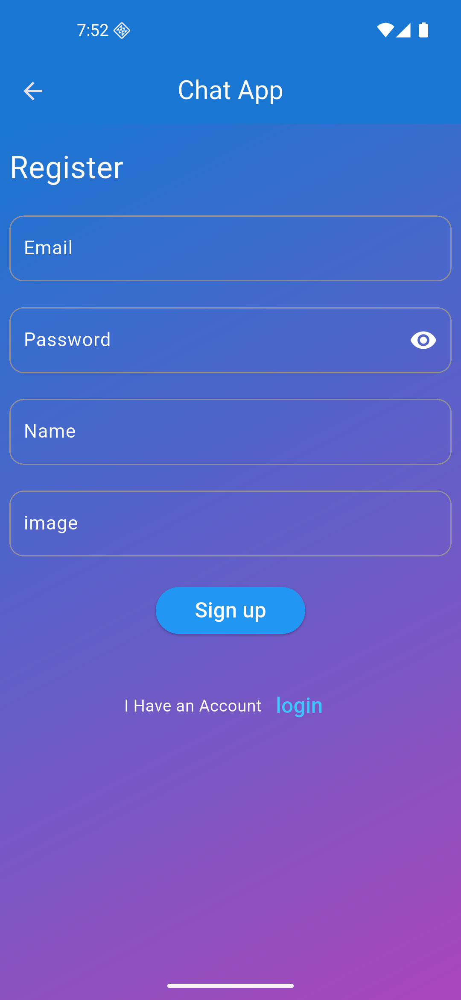
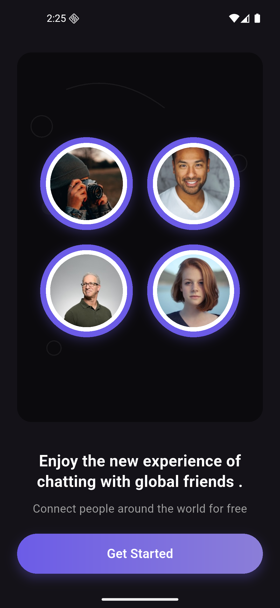
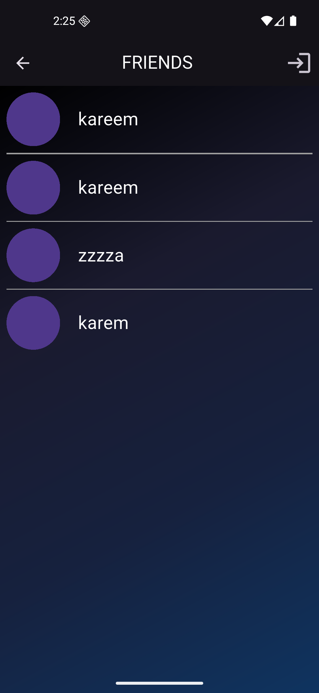
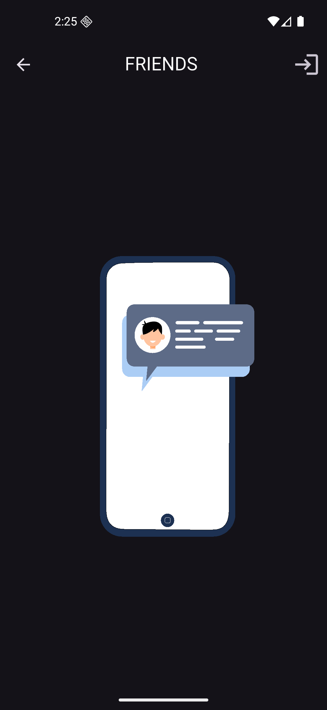
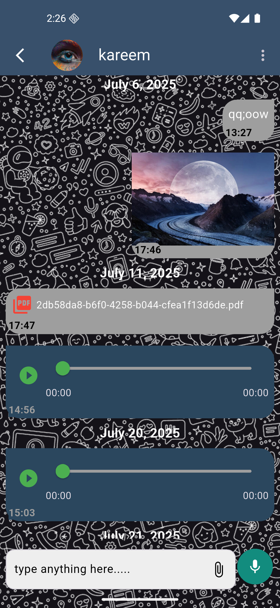

# 💬 Chat Me

<p align="center">
  
</p>

<p align="center">
  <strong>A modern, feature-rich instant messaging application</strong>
</p>

<p align="center">
  
  
  
</p>

---

**Chat Me** is an open-source instant messaging application built with **Flutter** and **Supabase**. Experience seamless communication with real-time messaging, media sharing, voice recordings, and cuurent location sharing—all wrapped in a beautiful, modern interface.

## ✨ Features

### 🚀 Core Functionality
- 💬 **Real-time Messaging** - Instant text communication with live updates
- 📷 **Media Sharing** - Share images, documents, and other media files effortlessly
- 🎤 **Voice Messages** - Record and play high-quality voice notes
- 📍 **Location Sharing** - Send your current location with integrated maps
- ☁️ **Cloud Storage** - Secure and fast data storage powered by Supabase

### 🎨 User Experience
- 🌙 **Dark/Light Mode** - Switch between themes for comfortable viewing
- 📱 **Cross-Platform** - Works seamlessly on iOS and Android
- 🔔 **Push Notifications** - Stay updated with real-time message alerts
- 🔒 **Privacy First** - End-to-end encryption for secure conversations
- ⚡ **Fast Performance** - Optimized for speed and reliability

## 📸 Screenshots

<p align="center">
  
  
  
  
  
  
  
  
  
  
</p>

## 🛠️ Installation & Setup

### Prerequisites
- [Flutter SDK](https://flutter.dev/docs/get-started/install) (version 3.0 or higher)
- [Dart SDK](https://dart.dev/get-dart) (version 2.17 or higher)
- Android Studio / VS Code with Flutter extensions
- A Supabase account and project

### 1. Clone the Repository
```bash
git clone https://github.com/kareemAlfara/Chat_Me.git
cd Chat_Me
```

### 2. Install Dependencies
```bash
flutter pub get
```

### 3. Supabase Configuration
1. Create a new project on [Supabase](https://supabase.com)
2. Copy your project URL and anon key
3. Create a `.env` file in the root directory:
```env
SUPABASE_URL=your_supabase_url_here
SUPABASE_ANON_KEY=your_supabase_anon_key_here
```

### 4. Database Setup
Run the provided SQL scripts in your Supabase SQL editor:
```sql
-- Copy and run the scripts from /database/setup.sql
```

### 5. Run the Application
```bash
# For development
flutter run

# For release build
flutter build apk --release  # Android
flutter build ios --release  # iOS
```

## 🏗️ Project Structure

```
lib/
├── core/
│   ├── constants/
│   ├── utils/
│   └── services/
├── features/
│   ├── auth/
│   ├── chat/
│   ├── media/
│   └── profile/
├── shared/
│   ├── widgets/
│   └── models/
└── main.dart
```

## 🤝 Contributing

We welcome contributions from the community! Here's how you can help:

1. **Fork** the repository
2. **Create** a feature branch (`git checkout -b feature/AmazingFeature`)
3. **Commit** your changes (`git commit -m 'Add some AmazingFeature'`)
4. **Push** to the branch (`git push origin feature/AmazingFeature`)
5. **Open** a Pull Request

### Development Guidelines
- Follow [Flutter's style guide](https://dart.dev/guides/language/effective-dart/style)
- Write meaningful commit messages
- Add tests for new features
- Update documentation as needed

## 🐛 Bug Reports & Feature Requests

Found a bug or have a feature idea? We'd love to hear from you!

- **Bug Reports**: [Create an issue](https://github.com/kareemAlfara/Chat_Me/issues/new?template=bug_report.md)
- **Feature Requests**: [Request a feature](https://github.com/kareemAlfara/Chat_Me/issues/new?template=feature_request.md)

## 📋 Roadmap

- [ ] Group messaging support
- [ ] Message reactions and replies
- [ ] File sharing improvements
- [ ] Video calling integration
- [ ] Desktop application support
- [ ] Message encryption enhancements

## 🔧 Built With

- **[Flutter](https://flutter.dev/)** - Cross-platform mobile development framework
- **[Supabase](https://supabase.com/)** - Backend-as-a-Service platform
- **[Provider](https://pub.dev/packages/provider)** - State management solution
- **[Image Picker](https://pub.dev/packages/image_picker)** - Image and camera access
- **[Audio Recorder](https://pub.dev/packages/audio_recorder)** - Voice message recording

<!-- ## 📄 License

This project is licensed under the MIT License - see the [LICENSE](LICENSE) file for details. -->

## 👨‍💻 Author

**Kareem Alfara**
- GitHub: [@kareemAlfara](https://github.com/kareemAlfara)
- Email: kareemelfara@gmail.com

## 🙏 Acknowledgments

- Thanks to the Flutter team for the amazing framework
- Supabase team for providing excellent backend services
- All contributors who helped improve this project
- The open-source community for inspiration and support

## 📞 Support

If you like this project, please consider:
- ⭐ Starring the repository
- 🐛 Reporting bugs
- 💡 Suggesting new features
- 🤝 Contributing to the codebase

---

<p align="center">
  Made with ❤️ using Flutter & Supabase
</p>